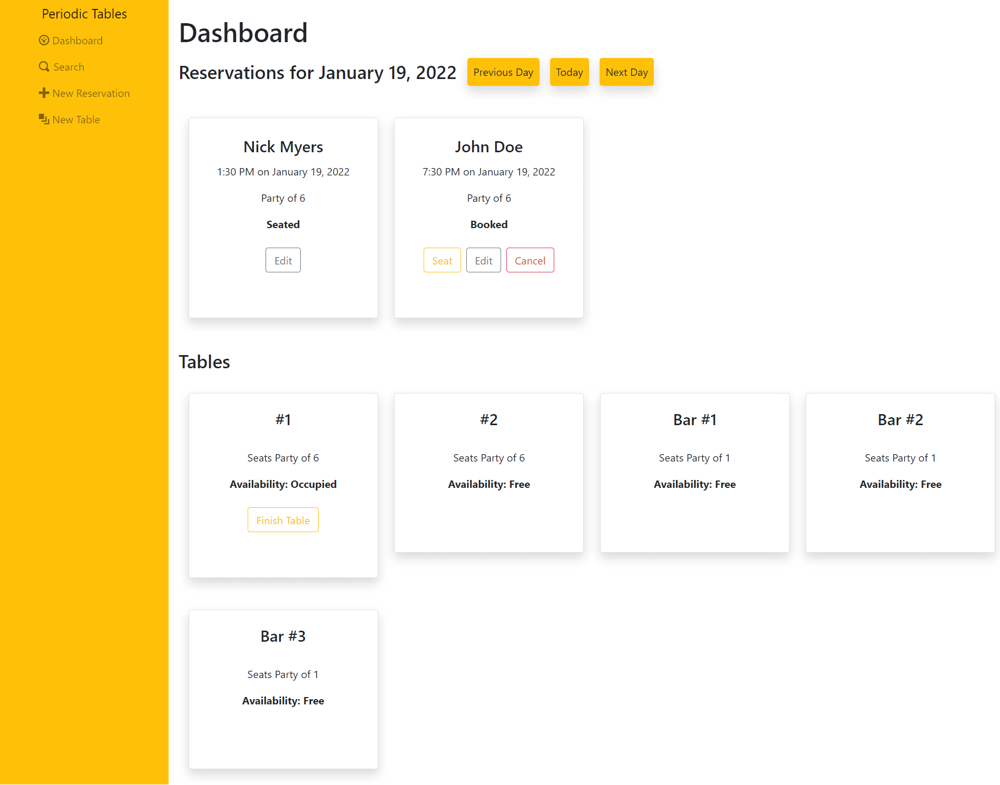
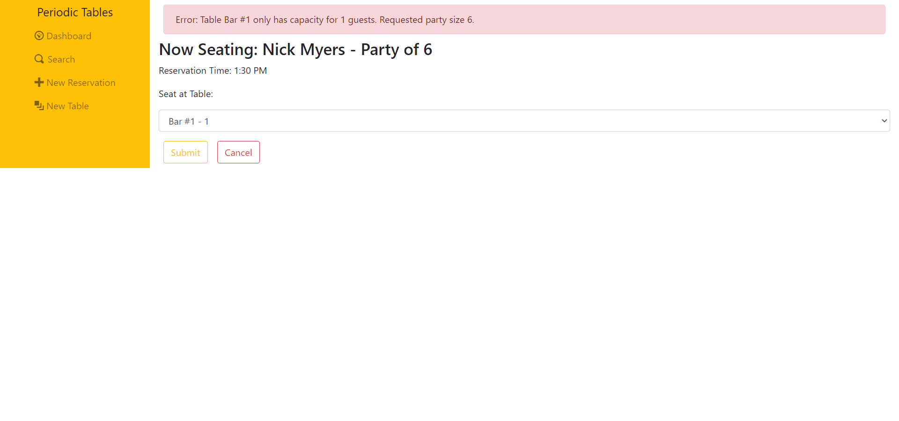

# :hamburger: Periodic Tables - Restaurant Reservation Application

⭐ **Final Capstone Project for Thinkful's Software Engineering program** ⭐

❗ **Project Prompt:** 

You have been hired as a full stack developer at *Periodic Tables*, a startup that is creating a reservation system for fine dining restaurants. The software is used only by restaurant personnel when a customer calls to request a reservation. At this point, the customers will not access the system online.

For this project, you'll need to create a full-stack web app that uses the stack that you've learned in this program: React on the client and Node.js and Express for the API. You'll also need to use PostgreSQL for your database. We recommend that you use Heroku to deploy this project.

The Product Manager has already created the user stories for *Periodic Tables*. Each of the user stories is listed below, and your Product Manager wants them to be implemented in the order in which they are listed. Another developer has already written the tests for each of the user stories so that you don't have to.

#### 🍕 US-01 Create and list reservations
As a restaurant manager
I want to create a new reservation when a customer calls
so that I know how many customers will arrive at the restaurant on a given day.

#### 🍕 US-02 Create reservation on a future, working date
As a restaurant manager
I only want to allow reservations to be created on a day when we are open
so that users do not accidentally create a reservation for days when we are closed.

#### 🍕 US-03 Create reservation within eligible timeframe
As a restaurant manager
I only want to allow reservations to be created during business hours, up to 60 minutes before closing
so that users do not accidentally create a reservation for a time we cannot accommodate.

#### 🍕 US-04 Seat reservation
As a restaurant manager,
When a customer with an existing reservation arrives at the restaurant
I want to seat (assign) their reservation to a specific table
so that I know which tables are occupied and free.

#### 🍕 US-05 Finish an occupied table
As a restaurant manager
I want to free up an occupied table when the guests leave
so that I can seat new guests at that table.

#### 🍕 US-06 Reservation Status
As a restaurant manager
I want a reservation to have a status of either booked, seated, or finished
so that I can see which reservation parties are seated, and finished reservations are hidden from the dashboard.

#### 🍕 US-07 Search for a reservation by phone number
As a restaurant manager
I want to search for a reservation by phone number **(partial or complete)**
so that I can quickly access a customer's reservation when they call about their reservation.

#### 🍕 US-08 Change an existing reservation
As a restaurant manager
I want to be able to modify a reservation if a customer calls to change or cancel their reservation
so that reservations are accurate and current.

## 🌟 Demo

[Click here for live demo]()

*Insert gif or video*

## 💻 Tech Stack

**Client:** JavaScript, React, CSS, Bootstrap

**Server:** Node, Express, Knex, PostgreSQL


## 🍟 Features

- Create a new reservation including the following info:
    - First Name
    - Last Name
    - Mobile Number
    - Date of reservation
    - Time of reservation
    - Number of people in the party
- Only allows reservations to be created during business hours:
    - No reservations on closed days
    - No reservations made for dates or times in the past.
    - No reservations made earlier than opening time, or later than 60 min before closing.
- Seat reservations at a specific table:
    - Cannot seat reservations at tables with a seating capacity less than the party size.
    - Cannot seat reservations at tables that are already occupied.
- A clear view of which tables are occupied and which are free on the dashboard
- A clear view of which reservations are booked (and waiting to be seated) and which are currently seated.
- Reservations with a status of "finished" are removed from the dashboard
- Search for reservations by partial or complete phone number
- Modify existing reservations if a customer calls to change or cancel their reservation
- Free up a previously occupied table when guests leave


## 📸 Screenshots
### 🍔 Full Dashboard View


### 🍔 Create Reservation
#### Create Reservation Form


#### Cannot Create Reservation After Closing


#### Cannot Create Reservation Before Open


#### Cannot Create Reservation in the Past


#### Cannot Create Reservation When Restaurant is Closed


#### Cannot Create Reservation with Missing Fields


### 🍔 Create Table
#### Create Table Form


#### Cannot Create Table With 1 Character Name


#### Correct Table Creation


#### New Table Displays on Dashboard


### 🍔 Search
#### Search By Full Mobile Number


#### Search By Partial Mobile Number


#### No Results - Number is Not Included in a Reservation


### 🍔 Edit Reservation
#### Edit Reservation Form - Jane Doe


#### BEFORE: Jane Doe's Reservation


#### AFTER: Jane Doe's Reservation (After Edit)


### 🍔 Cancel a Reservation
#### Cancel Reservation Window Alert


#### AFTER: Jane Doe's Reservation is Cancelled


### 🍔 Seat a Reservation
#### Seating Reservation Dropdown Menu


#### AFTER: Selecting Bar #1 for Nicole Macdonald - Party of 1


#### Cannot Seat a Reservation at an Occupied Table


#### Cannot Seat a Large Party at a Low Capacity Table


### 🍔 Finish a Table
#### Finish Table Window Alert - Free the Table Once the Guests Have Left


#### AFTER: Table Becomes Available


 


## 🗃️ Database Setup

For this application, you will need to create a PostgreSQL database.
A quick and easy way to create a PostgreSQL database is to use [ElephantSQL](https://www.elephantsql.com/).
Additionally, [DBeaver](https://dbeaver.io/) is a great tool for working with your PostgreSQL database.

1. Set up four new ElephantSQL database instances - development, test, preview, and production.
2. After setting up your database instances, connect DBeaver to your new database instances by following the instructions in the "PostgreSQL: Installing DBeaver" checkpoint.

> *Alternatively: set up four PostgreSQL database instances via your preferred method*

### Knex
Run ```npx knex``` commands from within the ```back-end``` folder, which is where the ```knexfile.js``` file is located.

## 🖥️ Run Locally

Clone the project

```bash
  git clone https://github.com/nikki-mac/starter-restaurant-reservation.git
```

Go to the project directory

```bash
  cd starter-restaurant-resrevation
```

Create ```.env``` file in ```back-end``` folder

```bash
  cp ./back-end/.env.sample ./back-end/.env.
```

Update the ```./back-end/.env``` file with the connection URL's to your ElephantSQL database instance.

Create ```.env``` file in ```front-end``` folder

```bash
  cp ./front-end/.env.sample ./front-end/.env.
```

You should not need to make changes to the ```./front-end/.env``` file unless you want to connect to a backend at a location other than ```http://localhost:5000```.

Install project dependencies

```bash
  npm install
```

Start the server in development mode

```bash
  npm run start:dev
```


## 📈 Running Tests

This project has unit, integration, and end-to-end (e2e) tests. 

* *End-to-end tests use browser automation to interact with the application just like the user does.* 

Once the tests are passing for a given user story, you have implemented the necessary functionality.

Test are split up by user story. You can run the tests for a given user story by running:

```bash
npm run test:X
``` 
where "X" is the user story number.

Have a look at the following examples:

- ```npm run test:1``` runs all the tests for user story 1 (both frontend and backend).
- ```npm run test:3:backend``` runs only the backend tests for user story 3.
- ```npm run test:3:frontend``` runs only the frontend tests for user story 3.
Since tests take time to run, you might want to consider running only the tests for the user story you're working on at any given time.

You can run **all** the tests using the following commands:
- ```npm test``` runs all tests.
- ```npm run test:backend``` runs all backend tests.
- ```npm run test:frontend``` runs all frontend tests.
- ```npm run test:e2e``` runs only the end-to-end tests.

If you would like a reminder of which npm scripts are available, run ```npm run``` to see a list of available commands.

> Note that the logging level for the backend is set to warn when running tests and info otherwise.

> Note: After running npm test, npm run test:X, or npm run test:e2e you might see something like the following in the output: [start:frontend] Assertion failed:. This > is not a failure, it is just the frontend project getting shutdown automatically.

> Note: If you are getting a unable to resolve dependency tree error when running the frontend tests, run the following command: npm install --force --prefix front-end.
> This will allow you to run the frontend tests.

> Hint: If you stop the tests before they finish, it can leave the test database in an unusual state causing the tests to fail unexpectedly the next time you run them. > If this happens, delete all tables in the test database, including the knex_* tables, and try the tests again.

### Frontend test timeout failure
Running the frontend tests on a resource constrained computer may result in timeout failures.

If you believe your implementation is correct, but needs a bit more time to finish, you can update the ```testTimeout``` value in ```front-end/e2e/jest.config.js```. A value of 10000 or even 12000 will give each test a few more seconds to complete.

##### Screenshots
To help you better understand what might be happening during the end-to-end tests, screenshots are taken at various points in the test.

The screenshots are saved in ```front-end/.screenshots``` and you can review them after running the end-to-end tests.

You can use the screenshots to debug your code by rendering additional information on the screen.

## 📓 Project Requirements and Acceptance Criteria

### US-01 Create and list reservations
As a restaurant manager
I want to create a new reservation when a customer calls
so that I know how many customers will arrive at the restaurant on a given day.

#### Acceptance Criteria
1. The ```/reservations/new``` page will
- have the following required and not-nullable fields:
    - First name: ```<input name="first_name" />```
    - Last name: ```<input name="last_name" />```
    - Mobile number: ```<input name="mobile_number" />```
    - Date of reservation: ```<input name="reservation_date" />```
    - Time of reservation: ```<input name="reservation_time" />```
    - Number of people in the party, which must be at least 1 person. ```<input name="people" />```
- display a ```Submit``` button that, when clicked, saves the new reservation, then displays the ```/dashboard``` page for the date of the new reservation
- display a ```Cancel``` button that, when clicked, returns the user to the previous page
- display any error messages returned from the API

2. The ```/dashboard``` page will
- list all reservations for one date only. (E.g. if the URL is ```/dashboard?date=2035-12-30``` then send a GET to ```/reservations?date=2035-12-30``` to list the reservations for that date). The date is defaulted to today, and the reservations are sorted by time.
- display next, previous, and today buttons that allow the user to see reservations on other dates
- display any error messages returned from the API

3. The ```/reservations``` API will have the same validations as above and will return 400, along with an informative error message, when a validation error happens.
- seed the reservations table with the data contained in ```./back-end/src/db/seeds/00-reservations.json```


### US-02 Create reservation on a future, working date
As a restaurant manager
I only want to allow reservations to be created on a day when we are open
so that users do not accidentally create a reservation for days when we are closed.

#### Acceptance criteria
1. The ```/reservations/new``` page will display an error message with ```className="alert alert-danger"``` if any of the following constraints are violated:
- The reservation date is a Tuesday as the restaurant is closed on Tuesdays.
- The reservation date is in the past. Only future reservations are allowed.
2. The ```/reservations``` API will have the same validations as above and will return 400, along with an informative error message, when a validation error happens.


### US-03 Create reservation within eligible timeframe
As a restaurant manager
I only want to allow reservations to be created during business hours, up to 60 minutes before closing
so that users do not accidentally create a reservation for a time we cannot accommodate.

#### Acceptance criteria
1. The ```/reservations/new``` page will display an error message with ```className="alert alert-danger"```, if any of the following additional constraints are violated:
- The reservation time is before 10:30 AM.
- The reservation time is after 9:30 PM, because the restaurant closes at 10:30 PM and the customer needs to have time to enjoy their meal.
- The reservation date and time combination is in the past. Only future reservations are allowed. E.g., if it is noon, only allow reservations starting *after* noon today.
2. The ```/reservations``` API will have the same validations as above and will return 400, along with an informative error message, when a validation error happens.

### US-04 Seat reservation
As a restaurant manager,
When a customer with an existing reservation arrives at the restaurant
I want to seat (assign) their reservation to a specific table
so that I know which tables are occupied and free.

#### Acceptance Criteria
1. The ```/tables/new``` page will:
- have the following required and not-nullable fields:
    - Table name: ```<input name="table_name" />```, which must be at least 2 characters long.
    - Capacity: ```<input name="capacity" />```, this is the number of people that can be seated at the table, which must be at least 1 person.
- display a ```Submit``` button that, when clicked, saves the new table then displays the ```/dashboard``` page
- display a ```Cancel``` button that, when clicked, returns the user to the previous page

2. The ```/dashboard``` page will:
-display a list of all reservations in one area.
- each reservation in the list will:
    - Display a ```Seat``` button on each reservation.
    - The ```Seat``` button must be a link with an ```href``` attribute that equals ```/reservations/${reservation_id}/seat```, so it can be found by the tests.
- display a list of all tables, sorted by ```table_name```, in another area of the dashboard
    - Each table will display "Free" or "Occupied" depending on whether a reservation is seated at the table.
    - The "Free" or "Occupied" text must have a ```data-table-id-status=${table.table_id}``` attribute, so it can be found by the tests.

3. The ```/reservations/:reservation_id/seat``` page will:
- have the following required and not-nullable fields:
    - Table number: ```<select name="table_id" />```. The text of each option must be ```{table.table_name} - {table.capacity}``` so the tests can find the options.
- do not seat a reservation with more people than the capacity of the table
- display a ```Submit``` button that, when clicked, assigns the table to the reservation then displays the ```/dashboard``` page
- ```PUT``` request to ```/tables/:table_id/seat/``` in order to save the table assignment. The body of the request must be ```{ data: { reservation_id: x } }``` where X is the ```reservation_id``` of the reservation being seated. The tests do not check the body returned by this request.
- display a ```Cancel``` button that, when clicked, returns the user to the previous page

4. The tables table must be seeded with the following data:
- ```Bar #1``` & ```Bar #2```, each with a capacity of 1.
- ```#1``` & ```#2```, each with a capacity of 6.

5. The ```/tables``` API will have the same validations as above and will return 400, along with an informative error message, when a validation error happens.
- if the table capacity is less than the number of people in the reservation, return 400 with an error message.
- if the table is occupied, return 400 with an error message.

### US-05 Finish an occupied table
As a restaurant manager
I want to free up an occupied table when the guests leave
so that I can seat new guests at that table.

#### Acceptance Criteria
1. The ```/dashboard``` page will:
- Display a ```Finish``` button on each *occupied* table.
- the ```Finish``` button must have a ```data-table-id-finish={table.table_id}``` attribute, so it can be found by the tests.
- Clicking the ```Finish``` button will display the following confirmation: ```"Is this table ready to seat new guests? This cannot be undone."``` If the user selects ```Ok``` the system will: - Send a ```DELETE``` request to ```/tables/:table_id/seat``` in order to remove the table assignment. The tests do not check the body returned by this request. 
- The server should return 400 if the table is not occupied. 
- Refresh the list of tables to show that the table is now available.
- Clicking the ```Cancel``` makes no changes.

### US-06 Reservation Status
As a restaurant manager
I want a reservation to have a status of either booked, seated, or finished
so that I can see which reservation parties are seated, and finished reservations are hidden from the dashboard.

#### Acceptance Criteria
1. The ```/dashboard``` page will
- display the status of the reservation. The default status is "booked"
    - the status text must have a ```data-reservation-id-status={reservation.reservation_id}``` attribute, so it can be found by the tests.
- display the ```Seat``` button only when the reservation status is "booked".
- clicking the ```Seat``` button changes the status to "seated" and hides the ```Seat``` button.
- clicking the ```Finish``` button associated with the table changes the reservation status to "finished" and removes the reservation from the dashboard.
- to set the status, make a ```PUT``` request to ```/reservations/:reservation_id/status``` with a body of ```{data: { status: "<new-status>" } }``` where ```<new-status>``` is one of "booked", "seated", or "finished"

### US-07 Search for a reservation by phone number
As a restaurant manager
I want to search for a reservation by phone number **(partial or complete)**
so that I can quickly access a customer's reservation when they call about their reservation.

#### Acceptance Criteria
1. The ```/search``` page will:
- Display a search box ```<input name="mobile_number" />``` that displays the placeholder text: ```"Enter a customer's phone number"```
- Display a ```Find``` button next to the search box.
- Clicking on the ```Find``` button will submit a request to the server (e.g. ```GET /reservations?mobile_number=800-555-1212```).
    - then the system will look for the reservation(s) in the database and display all matched records on the ```/search``` page using the same reservations list component as the ```/dashboard``` page.
    - the search page will display all reservations matching the phone number, regardless of status.
- display ```No reservations found``` if there are no records found after clicking the ```Find``` button.

### US-08 Change an existing reservation
As a restaurant manager
I want to be able to modify a reservation if a customer calls to change or cancel their reservation
so that reservations are accurate and current.

#### Acceptance Criteria
1. The ```/dashboard``` and the ```/search``` page will:
- Display an ```Edit``` button next to each reservation
    - Clicking the ```Edit``` button will navigate the user to the ```/reservations/:reservation_id/edit``` page
- the ```Edit``` button must be a link with an ```href``` attribute that equals ```/reservations/${reservation_id}/edit```, so it can be found by the tests.
- Display a ```Cancel``` button next to each reservation
- The ```Cancel``` button must have a ```data-reservation-id-cancel={reservation.reservation_id}``` attribute, so it can be found by the tests.
- Clicking the ```Cancel``` button will display the following confirmation: ```Do you want to cancel this reservation? This cannot be undone.```
    - Clicking ```Ok``` on the confirmation dialog sets the reservation status to "cancelled", and the results on the page are refreshed.
        - set the status of the reservation to "cancelled" using a ```PUT``` request to ```/reservations/:reservation_id/status``` with a body of ```{data: { status: "cancelled" } }```.
    - Clicking ```Cancel``` on the confirmation dialog makes no changes.

2. The ```/reservations/:reservation_id/edit``` page will display the reservation form with the existing reservation data filled in
- Only reservations with a status of "booked" can be edited.
- Clicking the ```Submit``` button will save the reservation, then display the previous page.
- Clicking the ```Cancel``` button makes no changes, then displays the previous pag
